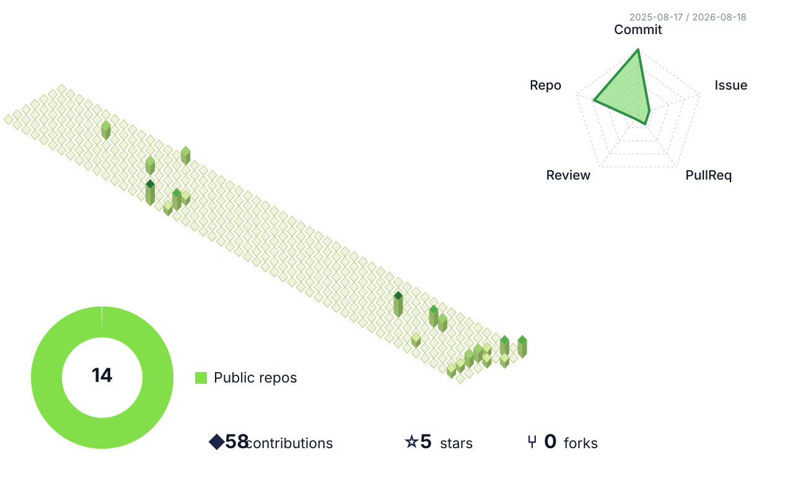

# Serral828

### Building useful tools, learning in public.

## About me

- 🔭 Currently building tools around knowledge management and developer productivity.
- 🌱 Exploring AI agents, Obsidian workflows and practical automation.
- 💬 Interested in open-source projects that make complex work feel simple.

## Featured project

- [Vault Knowledge Agent](https://github.com/Serral828/obsidian-vault-knowledge-agent) — an Obsidian knowledge-management agent with Vault-grounded answers, clickable evidence and reviewable changes.

这张图由 GitHub Actions 自动更新，展示公开贡献、仓库、Issue、Pull Request 和 Review 数据。
