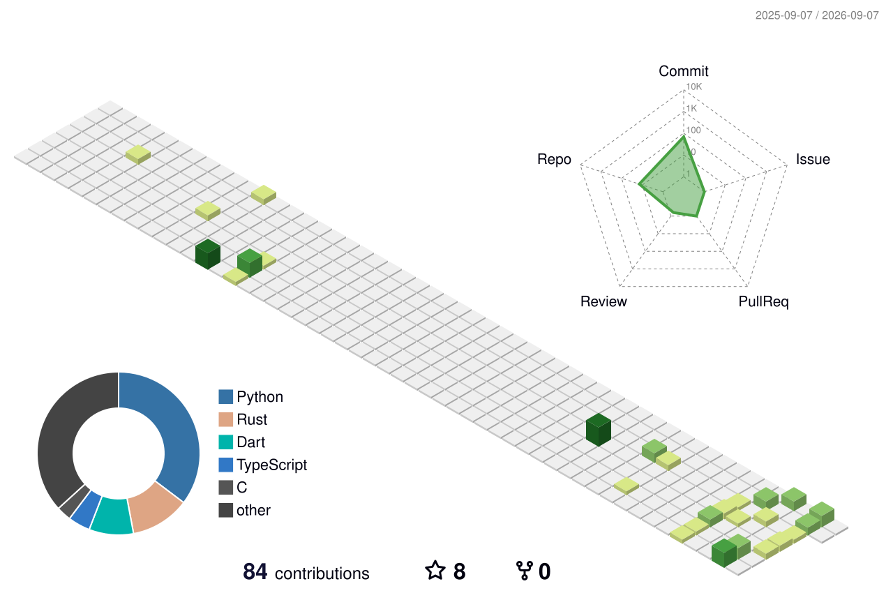

# Serral828

### Building useful tools, learning in public.

## About me

- 🔭 Currently building tools around knowledge management and developer productivity.
- 🌱 Exploring AI agents, Obsidian workflows and practical automation.
- 💬 Interested in open-source projects that make complex work feel simple.

## Featured project

- [Vault Knowledge Agent](https://github.com/Serral828/obsidian-vault-knowledge-agent) — an Obsidian knowledge-management agent with Vault-grounded answers, clickable evidence and reviewable changes.

3D contribution graphic generated by <a href="https://github.com/yoshi389111/github-profile-3d-contrib">github-profile-3d-contrib</a>.
